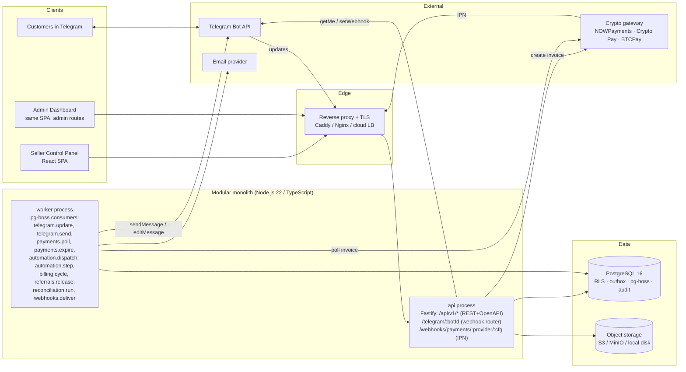
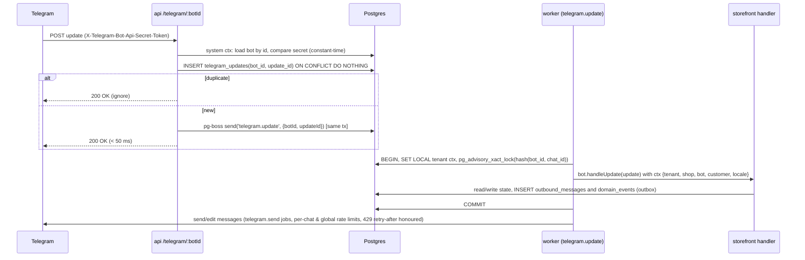
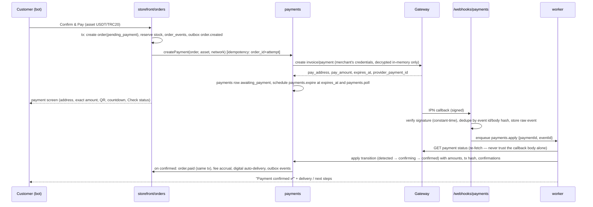

# 01 — Architecture & Stack

## 1. Architecture summary

**Style:** a *modular monolith* (one codebase, explicit module boundaries, one deployable image)
run as two process roles — `api` (HTTP + webhooks) and `worker` (queue consumers) — on top of a
single **PostgreSQL** database. Postgres also carries the job queue (pg-boss), the transactional
outbox and Row-Level Security for tenant isolation. Redis is *optional* (caching / distributed rate
limits at scale) and not required for MVP.

Why: the domain is transactional and money-adjacent (orders, payments, ledgers, referrals). Keeping
state changes, outbox events and job enqueueing in **one ACID transaction** removes an entire class
of distributed-systems bugs (lost events, double credits). The module boundaries let us split
services later (payments and the bot fleet are the natural first extractions) without a rewrite.



### 1.1 Key architectural decisions (ADRs in `docs/adr/`)

| ADR | Decision |
|---|---|
| 0001 | Modular monolith with `api` + `worker` roles; module boundaries enforced by lint rules |
| 0002 | Postgres-only infrastructure for MVP: pg-boss queue, transactional outbox, RLS; Redis optional |
| 0003 | Custody: **BYO gateway per merchant** for order payments; platform gateway only for merchant billing |
| 0004 | Drizzle ORM + SQL migrations (Prisma as alternative) |
| 0005 | Telegram via webhooks with a single multi-bot router; per-chat ordering with advisory locks |
| 0006 | Pure "screen renderers" shared by the bot and the web preview simulator |

## 2. Stack recommendation (with alternatives)

| Layer | Recommendation | Why | Alternatives |
|---|---|---|---|
| Language/runtime | **TypeScript on Node.js 22** | Repo is already TS; excellent Telegram & payments SDK ecosystem; one language across API, worker, web | Python (FastAPI + aiogram + SQLAlchemy) — equally viable; Go for the bot fleet later |
| HTTP framework | **Fastify 5** + `fastify-type-provider-zod` (OpenAPI 3.1 generated from Zod) | Fast, schema-first, `app.inject()` for tests, minimal magic | NestJS (more structure, more ceremony), Hono |
| Telegram | **grammY** (`bot.handleUpdate` per bot instance, LRU of `Bot` objects, `botInfo` pre-seeded) | Best-typed Bot API client, webhook-friendly, plugins (menus, i18n, throttler), fake-API-friendly for tests | Telegraf, node-telegram-bot-api |
| Database | **PostgreSQL 16** (numeric money columns, RLS, advisory locks, SKIP LOCKED, JSONB) | Single source of truth incl. queue & outbox | MySQL (no RLS parity), CockroachDB later |
| ORM / migrations | **Drizzle ORM + drizzle-kit** (SQL-flavoured, RLS policies declarable, raw SQL escape hatch) | Financial code wants explicit SQL and `numeric` control | Prisma 7 (great DX, but RLS needs interactive tx per request; Decimal handling heavier), Kysely |
| Jobs / scheduling | **pg-boss 12** (retry/backoff, cron, deferred jobs, singleton keys, dead-letter) | No Redis needed; jobs enqueued in the same tx as state changes | BullMQ + Redis (when throughput > ~1–2k jobs/s), Temporal (if workflows get heavy) |
| Validation & contracts | **Zod** schemas in `packages/shared`, reused by API, worker and web | One definition → runtime validation + TS types + OpenAPI | TypeBox, class-validator |
| Web app | **React 19 + Vite + TypeScript + Tailwind + shadcn/ui + TanStack Query + React Router** | Fast to build wizard/CRUD UIs; SPA is fine for authenticated apps; dev proxy to `/api` | Next.js (SSR for marketing site; heavier), SvelteKit |
| Auth | Server-side sessions (httpOnly, Secure, SameSite=Lax cookie) + **Argon2id**; TOTP 2FA (`otplib`); Telegram Login Widget as alt sign-in; scoped API keys | Simple revocation, no JWT foot-guns | JWT access/refresh; Auth.js; Clerk/Auth0 (vendor) |
| Crypto gateway | **Adapter interface** with reference adapter **NOWPayments** (BTC/ETH/LTC/USDT-TRC20, IPN HMAC-SHA512, sandbox, partial-payment status) + **Mock adapter** for tests | Matches the reference asset list; hosted, no keys in our infra | **Crypto Pay API (@CryptoBot)** — Telegram-native, very smooth UX; **BTCPay Server** — self-hosted, non-custodial (BTC/LTC native; TRC-20 not native); Coinbase Commerce; Cryptomus |
| Money math | `decimal.js` (app) ↔ `numeric(36,18)` crypto / `numeric(20,8)` quote amounts (DB) | Never floats | `big.js`, `dinero.js` (fiat only) |
| Secrets at rest | AES-256-GCM envelope encryption with key id (master key from env in dev, KMS/Vault in prod) | Bot tokens & gateway secrets are the crown jewels | Vault transit engine, cloud KMS direct |
| Object storage | S3-compatible (MinIO locally; local-disk adapter for dev) + Telegram `file_id` cache per bot | Cheap re-sends of media | Cloudflare R2 |
| Email | Adapter: SMTP (nodemailer) / Resend / SES; console adapter in dev | Invites, password reset, billing notices | — |
| Observability | `pino` structured logs (request_id, tenant_id, bot_id), Prometheus `/metrics` (`prom-client`), OpenTelemetry traces (optional), Sentry (optional), health endpoints | Cheap, standard | Datadog, Grafana Cloud |
| Testing | **Vitest**; real Postgres in tests via `embedded-postgres` (no Docker needed) or `DATABASE_URL`; fake Telegram Bot API server; mock gateway; `autocannon` for load smoke | Tenant isolation & money logic must be tested against real SQL/RLS | Jest, Playwright (web e2e later) |
| Packaging / deploy | pnpm workspaces, one Docker image (roles by `ROLE=api|worker`), **docker-compose** for single-VM (Caddy TLS), GitHub Actions CI | Simple ops for MVP | Kubernetes/Helm, Fly.io, Render, Railway |
| Backups | Nightly `pg_dump` + WAL archiving (pgBackRest/wal-g) for PITR, encrypted, off-site; restore drill script | Money data | Managed Postgres with PITR (RDS, Neon, Supabase) |

### 2.1 Why not X?

* **Long polling per bot** — does not scale past a few dozen bots per process and can't be
  load-balanced. Webhooks with one router endpoint scale to thousands of bots.
* **Own wallets / chain scanning** — key management, reorgs, fee estimation and network diversity are
  a full product on their own; the brief explicitly forbids it.
* **Schema-per-tenant** — thousands of small merchants; shared schema + `tenant_id` + RLS is the
  standard fit and keeps migrations simple.
* **Microservices from day one** — no team or traffic justification; we keep boundaries clean instead.

## 3. Module map (bounded contexts)

All modules live in `packages/core/src/modules/<name>` and expose a small public API
(`index.ts`). Cross-module calls go through those public APIs or through domain events; direct
table access across modules is prohibited (lint rule: `no-restricted-imports`).

| Module | Owns | Emits events |
|---|---|---|
| `identity` | users, sessions, 2FA, memberships, invitations, API keys, RBAC | `user.created`, `member.invited` |
| `tenancy` | tenants, plan limits & usage enforcement, feature gates | `tenant.created`, `tenant.suspended` |
| `shops` | shop config, onboarding wizard state, templates, policies, branding, i18n overrides | `shop.launched`, `shop.paused` |
| `bots` | bot provisioning (getMe, setWebhook, secret), update ingestion & dedupe, outbound sender, Telegram client & rate limiting, `file_id` cache | `bot.activated`, `bot.error` |
| `storefront` | the customer conversation (pure screen renderers + grammY handlers), conversation state | `customer.started`, `cart.updated`, `checkout.abandoned` |
| `catalog` | categories, products, variants, digital item pools, media, inventory movements, CSV import | `product.out_of_stock`, `digital_pool.low` |
| `customers` | customer profiles, addresses, tags, blocking, timeline | `customer.created`, `customer.tagged` |
| `orders` | carts, checkout, orders, fulfilment, coupons, shipping methods, refunds (order side) | `order.*` |
| `payments` | gateway adapters, payments, payment events, webhook inbox, expiry, polling, reconciliation | `payment.*` |
| `ledger` | accounts, journals, entries, balances, top-ups | `topup.credited`, `ledger.adjusted` |
| `billing` | plans, subscriptions, invoices, fee accruals, usage counters, dunning | `subscription.*`, `invoice.*` |
| `referrals` | programs, codes, attribution, qualification, commissions, holds, reversals, payouts | `referral.*` |
| `automation` | rules, outbox dispatch, run execution, actions, outgoing webhooks, broadcasts | `automation.run.*` |
| `support` | tickets, messages, staff routing | `ticket.*` |
| `analytics` | read models / aggregates for dashboards | — |
| `audit` | append-only audit log, request context | — |
| `admin` | platform settings, feature flags, impersonation, reconciliation UI backend | `settings.changed` |
| `notifications` | staff notifications (panel + Telegram), email adapter | — |

## 4. Repository layout (target)

```
botshop/
  package.json               # pnpm workspace root, scripts: dev, test, lint, typecheck, db:*
  pnpm-workspace.yaml
  .env.example
  apps/
    api/                     # Fastify server (HTTP API + Telegram webhook + IPN); can also run worker in-process in dev
    worker/                  # pg-boss consumers (thin entry over packages/core)
    web/                     # React SPA: seller panel + admin dashboard (+ bot preview simulator)
  packages/
    shared/                  # Zod schemas, API types, constants, event & action catalogs, templates (JSON)
    db/                      # drizzle schema, migrations (SQL), RLS policies, seed, test-db helper (embedded-postgres)
    core/                    # domain modules (see §3), state machines, services, adapters interfaces
    payments/                # gateway adapters: nowpayments, cryptopay, btcpay (later), mock
    telegram/                # grammY app: screens, keyboards, handlers, i18n catalogs, fake Bot API for tests
  infra/
    docker-compose.yml       # postgres, api, worker, web, caddy
    Caddyfile
    Dockerfile               # single image, ROLE=api|worker
  docs/
```

## 5. Multi-tenancy model

* Every tenant-scoped table has `tenant_id uuid NOT NULL` (denormalised even where derivable through
  `shop_id`) — this is what RLS policies and indexes key on.
* The app connects as `botshop_app` (not the table owner, `NOBYPASSRLS`). Migrations run as
  `botshop_migrator`.
* Each unit of work runs inside a transaction that first sets the context:
  `SET LOCAL app.tenant_id = '<uuid>'; SET LOCAL app.actor_role = 'tenant' | 'platform' | 'system';`
* Policies: `USING (tenant_id = current_setting('app.tenant_id', true)::uuid OR current_setting('app.actor_role', true) IN ('platform','system'))` with matching `WITH CHECK`.
* The application layer *also* scopes every query by `tenant_id` (repository helpers receive a
  `TenantContext`; there is no "unscoped" repository outside `admin`/`system` code paths). RLS is
  the safety net; tests try to cross tenants through both layers.
* Telegram updates: the router resolves `bot_id → tenant_id` in a `system` context, then runs the
  handler in the tenant's context.
* Platform-level rows (plans, platform settings, platform referral program) have `tenant_id NULL`
  and are readable by everyone, writable only by `platform`.

## 6. Core request flows

### 6.1 Telegram update (customer taps a button)



Design points: the webhook handler never does business logic; per-chat serialization via advisory
lock keeps FSM state consistent; the update payload is stored briefly (7 days) for replay/debug;
`allowed_updates` is restricted to `message`, `callback_query`, `my_chat_member`, `pre_checkout_query`.

### 6.2 Checkout & crypto payment (BYO gateway)



### 6.3 Merchant billing

Subscription cycle job (`billing.cycle`, hourly) finds subscriptions with `current_period_end <=
now()`, creates an invoice (subscription line + accrued transaction fees + overages − discounts),
attempts to settle it from the merchant's **platform balance** (ledger journal). If insufficient:
`past_due` → grace period (configurable, e.g. 3 days) with reminders → `suspended` (bots answer
with a "shop temporarily unavailable" screen, panel read-only) → `cancelled` after N days. Top-ups
are crypto payments with `purpose = merchant_topup` on the platform's gateway account; on
`confirmed` the ledger credits the balance and retries open invoices. Referral commissions on
top-ups are computed here (see referrals).

### 6.4 Automation

State changes write `domain_events` in the same transaction. The `automation.dispatch` worker
consumes unpublished events (SKIP LOCKED batches), fans out to: matching automation rules (creates
`automation_runs`), staff notifications, outgoing webhooks, analytics. Runs execute step by step;
`wait` schedules a deferred `automation.step` job carrying `(run_id, step_index)`; every step is
recorded for observability; per-customer run limits and cooldowns prevent spam.

## 7. Telegram bot fleet specifics

* One webhook URL per bot: `https://<host>/telegram/<bot_id>`; `secret_token` random 64 chars,
  stored hashed; `max_connections` configurable per bot (default 40).
* `Bot` instances are created lazily per `bot_id` with the decrypted token and pre-seeded
  `botInfo` (no `getMe` per cold start), cached in an LRU (size ~ 5k), evicted on token rotation.
* One shared grammY `Composer` implements the storefront; a per-bot middleware injects tenant/shop
  context, locale and customer.
* Outbound sending goes through `outbound_messages` + `telegram.send` jobs with a token bucket per
  bot (≈ 25 msg/s) and per chat (1 msg/s), honouring `retry_after`. `403 blocked by user` marks the
  customer `blocked_bot`. All user-supplied text is HTML-escaped before rendering.
* Bot health: `getWebhookInfo` polled every 10 min (pending updates, last error) → `bots.status`,
  surfaced in the panel and admin dashboard.
* Bot metadata set from the wizard: `setMyCommands`, `setMyName`, `setMyDescription`,
  `setMyShortDescription`, menu button.

## 8. Web preview ("see it before you launch")

Storefront screens are **pure functions** `(screenId, state, locale, shopConfig) → { text,
keyboard, media }` in `packages/telegram/screens`. The bot handlers call them and so does
`GET /shops/:id/preview/:screen` — the panel renders a Telegram-styled chat simulator with clickable
inline buttons that walk the same screen graph. Zero divergence between preview and live bot.

## 9. Deployment topology

* **Single VM (MVP):** docker-compose: `caddy` (auto-TLS) → `api` (2 replicas) + `worker` (1–2) →
  `postgres` (volume + backup sidecar). Fits thousands of low-traffic bots.
* **Scale-out:** stateless `api`/`worker` behind a load balancer; managed Postgres with PITR; move
  telegram sending to dedicated workers; add Redis for rate limits/cache; extract `payments` first if
  isolation/compliance demands.
* Environments: `local` (embedded Postgres, mock gateway, fake Telegram API), `staging` (gateway
  sandbox, real Telegram test bots), `prod`.
* CI (GitHub Actions): lint → typecheck → unit → integration (Postgres service) → build image →
  (main) push image → deploy job.

## 10. Observability & operations

| Concern | Implementation |
|---|---|
| Logs | pino JSON; fields: `request_id`, `tenant_id`, `shop_id`, `bot_id`, `chat_id` (hashed in prod), `job_id`; secrets redacted by path (`token`, `api_key`, `ipn_secret`, `authorization`) |
| Metrics | webhook latency, updates lag (received→processed), outbound failures by code, payment transitions by state, reconciliation mismatches (alert > 0), IPN signature failures (alert on spike), queue depth/fail counts, subscription charge failures, bot errors |
| Health | `/healthz` (process), `/readyz` (DB + queue), per-bot `getWebhookInfo` |
| Alerts | to a platform ops Telegram chat + email; runbooks linked from alerts |
| Backups | nightly dump + WAL archiving, 30-day retention, encrypted, monthly restore drill (scripted) |
| Audit | append-only `audit_logs` for every mutating request and sensitive read (secret reveal, impersonation) |
