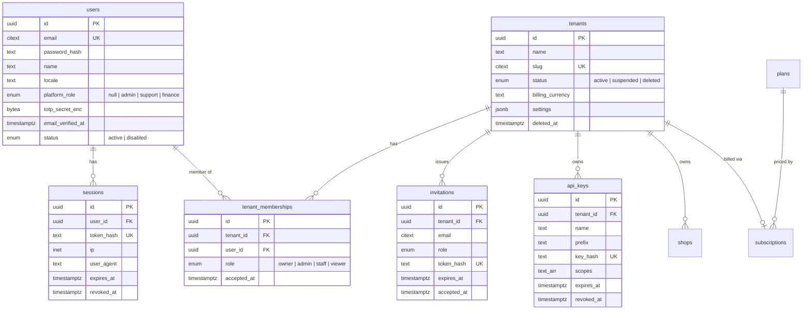
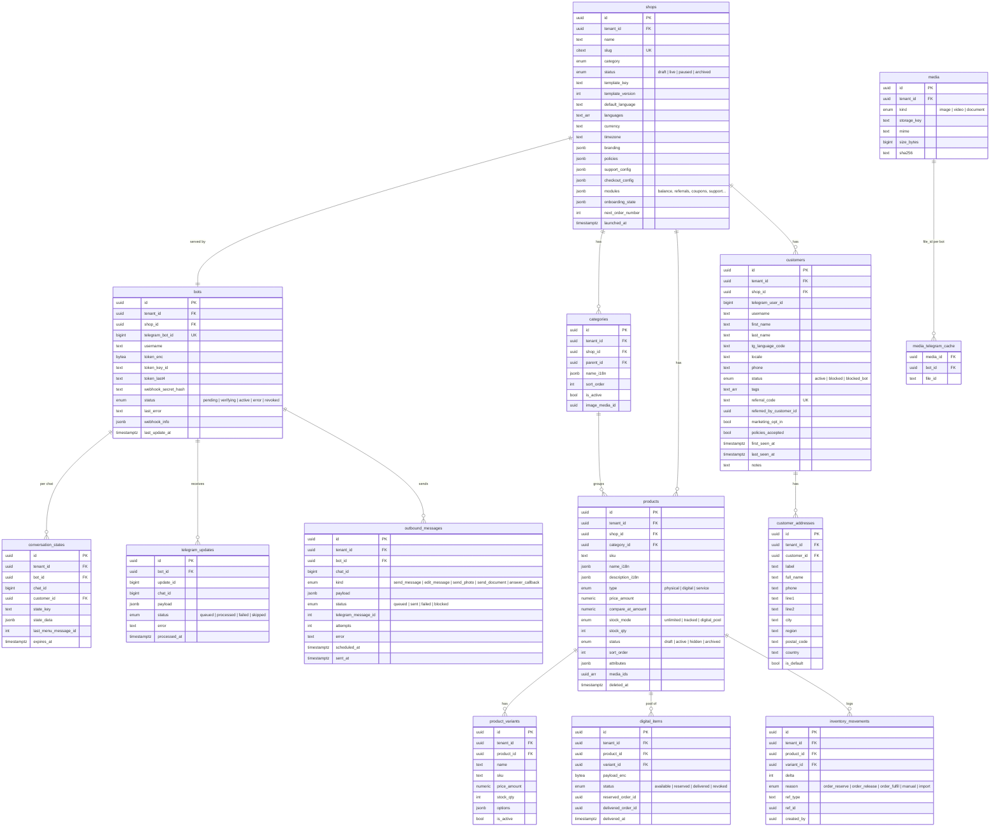
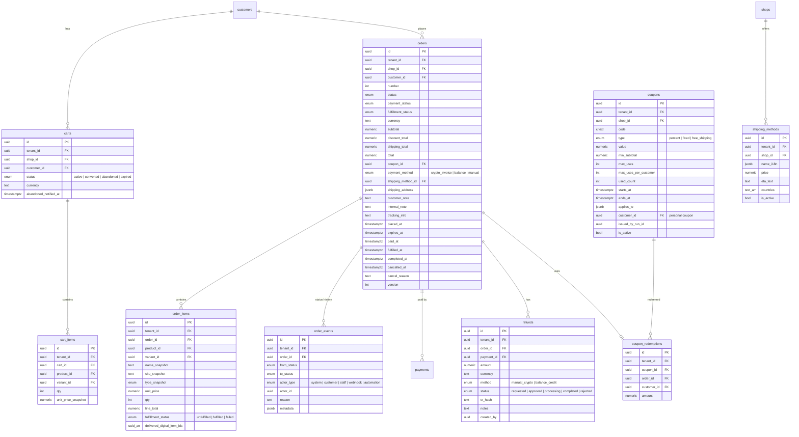
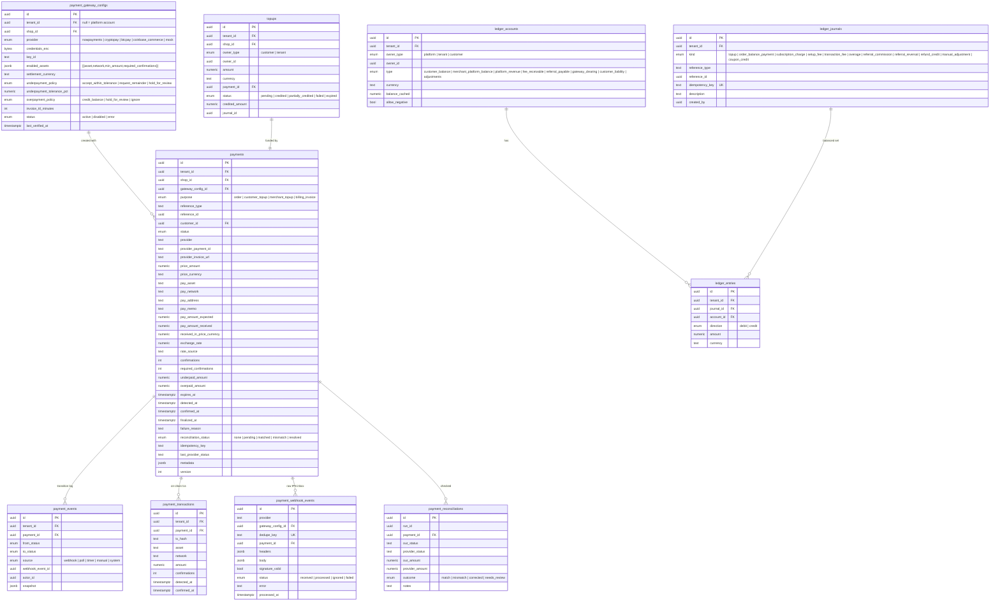

# 02 — Data Model (ERD + table catalog)

Conventions

* PostgreSQL 16. Primary keys are `uuid` (UUIDv7 generated in app for time-ordering). Every
  tenant-scoped table carries `tenant_id uuid NOT NULL` (RLS key) even when derivable.
* Timestamps `timestamptz`, `created_at`/`updated_at` on every table (omitted below for brevity).
  Soft delete via `deleted_at` only where noted.
* Money: quote/fiat amounts `numeric(20,8)`; crypto amounts `numeric(36,18)`; percentages
  `numeric(7,4)`. Never `float`. Every amount column has a sibling `currency` (ISO code or asset
  ticker) or inherits it from the parent row.
* Enumerations are Postgres `enum` types (listed in §3) so invalid states cannot be stored.
* JSONB columns are validated by Zod schemas in `packages/shared` before write.
* Platform-scoped rows (plans, platform settings, platform referral program) have `tenant_id NULL`.

## 1. ERD by domain (Mermaid)

### 1.1 Identity & tenancy



### 1.2 Shops, bots, catalog, customers



### 1.3 Carts, orders, coupons



### 1.4 Payments, ledger, top-ups



### 1.5 Billing, referrals, automation, support, platform

```mermaid
erDiagram
  plans ||--o{ subscriptions : has
  subscriptions ||--o{ billing_invoices : generates
  billing_invoices ||--o{ billing_invoice_lines : has
  orders ||--o| fee_accruals : "platform fee"
  referral_programs ||--o{ referral_codes : issues
  referral_programs ||--o{ referrals : tracks
  referral_codes ||--o{ referrals : attributed
  referrals ||--o{ referral_commissions : earns
  automation_rules ||--o{ automation_runs : triggers
  domain_events ||--o{ automation_runs : causes
  automation_runs ||--o{ automation_run_steps : executes
  webhook_endpoints ||--o{ webhook_deliveries : receives
  support_tickets ||--o{ support_messages : has
  plans {
    uuid id PK
    text key "starter | growth | pro | agency"
    text name
    text description
    numeric monthly_price
    numeric annual_price
    text currency
    numeric setup_fee
    int trial_days
    numeric transaction_fee_pct
    numeric transaction_fee_fixed
    jsonb limits "products, orders_per_month, bots, automation_rules, automation_runs_per_month, staff_seats, storage_mb, broadcasts_per_month"
    jsonb features "custom_branding, remove_powered_by, webhooks, api_access, priority_support, white_label, custom_domain"
    jsonb overage "mode: block|soft|charge, unit prices"
    bool is_public
    bool is_active
    int version
  }
  discounts {
    uuid id PK
    citext code UK
    enum type "percent | fixed"
    numeric value
    enum duration "once | repeating | forever"
    int duration_months
    uuid_arr plan_ids
    int max_redemptions
    int redeemed_count
    timestamptz expires_at
  }
  subscriptions {
    uuid id PK
    uuid tenant_id FK
    uuid plan_id FK
    enum status "trialing | active | past_due | grace | suspended | cancelled | expired"
    enum interval "monthly | annual"
    timestamptz trial_ends_at
    timestamptz current_period_start
    timestamptz current_period_end
    bool cancel_at_period_end
    uuid discount_id FK
    int discount_periods_left
    timestamptz next_charge_attempt_at
    int charge_attempts
  }
  billing_invoices {
    uuid id PK
    uuid tenant_id FK
    uuid subscription_id FK
    text number UK
    enum status "draft | open | paid | void | uncollectible"
    numeric subtotal
    numeric discount_total
    numeric total
    text currency
    timestamptz due_at
    timestamptz paid_at
    enum paid_via "balance | payment"
    uuid payment_id
    uuid journal_id
  }
  billing_invoice_lines {
    uuid id PK
    uuid invoice_id FK
    enum kind "subscription | setup_fee | transaction_fees | overage | addon | credit"
    text description
    numeric quantity
    numeric unit_amount
    numeric amount
    timestamptz period_start
    timestamptz period_end
  }
  fee_accruals {
    uuid id PK
    uuid tenant_id FK
    uuid order_id FK
    uuid payment_id FK
    numeric base_amount
    numeric fee_pct
    numeric fee_fixed
    numeric fee_amount
    text currency
    enum status "accrued | invoiced | settled | waived | reversed"
    uuid invoice_id
  }
  usage_counters {
    uuid tenant_id FK
    enum metric "orders | automation_runs | broadcasts | messages"
    date period_start
    bigint count
  }
  referral_programs {
    uuid id PK
    uuid tenant_id FK "null = platform affiliate"
    uuid shop_id FK
    enum scope "platform_affiliate | shop_customer"
    text name
    enum commission_type "percent | fixed"
    numeric commission_value "default 10"
    enum commission_basis "topup | order_paid | subscription_payment | first_order_only"
    text reward_currency
    numeric min_qualifying_amount
    int hold_days
    int attribution_window_days
    numeric max_commission_per_referral
    numeric max_commission_per_month
    jsonb abuse_rules
    enum payout_method "ledger_credit | manual"
    bool is_active
  }
  referral_codes {
    uuid id PK
    uuid program_id FK
    enum owner_type "tenant | user | customer"
    uuid owner_id
    citext code UK
    int clicks
    enum status "active | disabled"
  }
  referrals {
    uuid id PK
    uuid program_id FK
    uuid code_id FK
    enum referrer_type
    uuid referrer_id
    enum referee_type
    uuid referee_id
    enum status "attributed | qualified | active | rejected | expired | revoked"
    timestamptz attributed_at
    timestamptz qualified_at
    timestamptz expires_at
    text rejection_reason
    jsonb fraud_flags
  }
  referral_commissions {
    uuid id PK
    uuid tenant_id FK
    uuid program_id FK
    uuid referral_id FK
    enum source_type "payment | topup | order | invoice"
    uuid source_id
    numeric base_amount
    numeric rate
    numeric amount
    text currency
    enum status "pending | held | approved | paid | reversed | rejected"
    timestamptz hold_until
    uuid journal_id
    uuid reversal_journal_id
    text reason
  }
  referral_payouts {
    uuid id PK
    uuid program_id FK
    enum owner_type
    uuid owner_id
    numeric amount
    text currency
    enum status "requested | approved | paid | rejected"
    text destination
    text tx_hash
  }
  automation_rules {
    uuid id PK
    uuid tenant_id FK
    uuid shop_id FK
    text name
    text trigger_event
    jsonb conditions
    jsonb actions
    bool is_enabled
    int priority
    int max_runs_per_customer
    int cooldown_seconds
    int version
    text template_key
    jsonb stats
  }
  domain_events {
    uuid id PK
    uuid tenant_id FK
    uuid shop_id FK
    text event_type
    text aggregate_type
    uuid aggregate_id
    uuid customer_id
    jsonb payload
    text dedupe_key UK
    timestamptz occurred_at
    timestamptz published_at
  }
  automation_runs {
    uuid id PK
    uuid tenant_id FK
    uuid rule_id FK
    uuid event_id FK
    uuid customer_id FK
    enum status "pending | running | waiting | completed | failed | cancelled | skipped"
    int current_step
    jsonb context
    timestamptz resume_at
    timestamptz finished_at
    text error
  }
  automation_run_steps {
    uuid id PK
    uuid run_id FK
    int step_index
    text action_type
    enum status "pending | done | failed | skipped"
    jsonb input
    jsonb output
    text error
  }
  webhook_endpoints {
    uuid id PK
    uuid tenant_id FK
    text url
    bytea secret_enc
    text_arr events
    bool is_active
    int consecutive_failures
  }
  webhook_deliveries {
    uuid id PK
    uuid tenant_id FK
    uuid endpoint_id FK
    uuid event_id FK
    int attempt
    enum status "pending | delivered | failed | dead"
    int response_code
    text response_excerpt
    timestamptz next_retry_at
  }
  message_templates {
    uuid id PK
    uuid tenant_id FK
    uuid shop_id FK
    text key
    text locale
    text body
    jsonb buttons
    uuid media_id
  }
  broadcasts {
    uuid id PK
    uuid tenant_id FK
    uuid shop_id FK
    jsonb segment
    text body
    uuid media_id
    enum status "draft | scheduled | sending | done | cancelled"
    timestamptz scheduled_at
    jsonb stats
  }
  support_tickets {
    uuid id PK
    uuid tenant_id FK
    uuid shop_id FK
    uuid customer_id FK
    uuid order_id FK
    int number
    text subject
    enum status "open | pending_customer | pending_staff | resolved | closed"
    enum priority "low | normal | high"
    uuid assigned_user_id
    timestamptz last_message_at
  }
  support_messages {
    uuid id PK
    uuid tenant_id FK
    uuid ticket_id FK
    enum sender_type "customer | staff | system"
    uuid sender_id
    text body
    uuid media_id
    int telegram_message_id
  }
  audit_logs {
    uuid id PK
    uuid tenant_id FK
    enum actor_type "user | api_key | system | customer | impersonation"
    uuid actor_id
    uuid impersonator_id
    text action
    text entity_type
    uuid entity_id
    jsonb before
    jsonb after
    inet ip
    text user_agent
    text request_id
  }
  platform_settings {
    text key PK
    jsonb value
    uuid updated_by
  }
  feature_flags {
    text key PK
    bool enabled
    jsonb rules
  }
  idempotency_keys {
    uuid tenant_id FK
    text key
    text request_hash
    int response_status
    jsonb response_body
    timestamptz expires_at
  }
  staff_telegram_links {
    uuid id PK
    uuid tenant_id FK
    uuid user_id FK
    bigint telegram_user_id
    uuid bot_id FK
    bool notify_orders
    bool notify_tickets
    bool notify_payments
  }
```



## 2. Table catalog — constraints and indexes that matter

| Table | Unique / check constraints | Key indexes |
|---|---|---|
| `tenant_memberships` | `UNIQUE(tenant_id, user_id)`; at least one `owner` per tenant (app-enforced + deferred trigger) | `(user_id)` |
| `bots` | `UNIQUE(telegram_bot_id)`; `UNIQUE(shop_id)` (one bot per shop in MVP) | `(tenant_id)` |
| `customers` | `UNIQUE(shop_id, telegram_user_id)`; `UNIQUE(referral_code)` | `(tenant_id, shop_id, last_seen_at)`, GIN `(tags)` |
| `conversation_states` | `UNIQUE(bot_id, chat_id)` | `(expires_at)` |
| `telegram_updates` | `UNIQUE(bot_id, update_id)` — **idempotency** | `(received_at)` for retention purge |
| `outbound_messages` | — | `(status, scheduled_at)`, `(bot_id, chat_id)` |
| `products` | `UNIQUE(shop_id, sku) WHERE sku IS NOT NULL AND deleted_at IS NULL`; `CHECK(price_amount >= 0)` | `(tenant_id, shop_id, category_id, status, sort_order)` |
| `digital_items` | `CHECK(status <> 'reserved' OR reserved_order_id IS NOT NULL)` | `(product_id, status)` — reservation uses `FOR UPDATE SKIP LOCKED` |
| `carts` | one `active` cart per customer: `UNIQUE(customer_id) WHERE status='active'` | `(status, updated_at)` for abandonment scan |
| `orders` | `UNIQUE(shop_id, number)`; `CHECK(total = subtotal - discount_total + shipping_total)`; `version` for optimistic locking | `(tenant_id, shop_id, status, placed_at desc)`, `(customer_id, placed_at desc)`, `(status, expires_at)` |
| `coupon_redemptions` | `UNIQUE(coupon_id, order_id)` | `(customer_id, coupon_id)` |
| `payments` | `UNIQUE(provider, provider_payment_id)`; `UNIQUE(tenant_id, idempotency_key)`; `CHECK(pay_amount_received >= 0)` | `(status, expires_at)`, `(reference_type, reference_id)`, `(status, updated_at)` for polling |
| `payment_transactions` | `UNIQUE(payment_id, tx_hash)` | — |
| `payment_webhook_events` | `UNIQUE(dedupe_key)` (= provider event id, else `sha256(provider, body)`) | `(payment_id)`, `(status, received_at)` |
| `ledger_accounts` | `UNIQUE(owner_type, owner_id, type, currency)`; `CHECK(allow_negative OR balance_cached >= 0)` | — |
| `ledger_journals` | `UNIQUE(idempotency_key)` | `(reference_type, reference_id)` |
| `ledger_entries` | deferred constraint trigger: per journal `SUM(debit) = SUM(credit)` and single currency | `(account_id, created_at)` |
| `topups` | `UNIQUE(payment_id)` | `(owner_type, owner_id, created_at desc)` |
| `subscriptions` | one non-terminal subscription per tenant: `UNIQUE(tenant_id) WHERE status NOT IN ('cancelled','expired')` | `(status, current_period_end)` |
| `fee_accruals` | `UNIQUE(order_id)` | `(tenant_id, status)` |
| `usage_counters` | `PRIMARY KEY(tenant_id, metric, period_start)` | — |
| `referral_codes` | `UNIQUE(code)`; `UNIQUE(program_id, owner_type, owner_id)` | — |
| `referrals` | `UNIQUE(program_id, referee_type, referee_id)` — **first-touch, immutable**; `CHECK(NOT (referrer_type = referee_type AND referrer_id = referee_id))` | `(referrer_type, referrer_id, status)` |
| `referral_commissions` | `UNIQUE(program_id, source_type, source_id)` — one commission per source | `(status, hold_until)` |
| `domain_events` | `UNIQUE(dedupe_key)` | `(published_at) WHERE published_at IS NULL` (outbox scan), `(tenant_id, aggregate_type, aggregate_id)` |
| `automation_runs` | `UNIQUE(rule_id, event_id)` | `(status, resume_at)` |
| `webhook_deliveries` | — | `(status, next_retry_at)` |
| `support_tickets` | `UNIQUE(shop_id, number)` | `(tenant_id, status, last_message_at desc)` |
| `audit_logs` | append-only (no UPDATE/DELETE grants); monthly partitions | `(tenant_id, created_at desc)`, `(entity_type, entity_id)` |
| `idempotency_keys` | `PRIMARY KEY(tenant_id, key)` | `(expires_at)` |

## 3. Enumerations (authoritative lists)

* `order_status`: `pending_payment, paid, processing, shipped, delivered, completed, cancelled, expired, refunded, partially_refunded, disputed`
* `order_payment_status`: `unpaid, awaiting, underpaid, paid, overpaid, refunded, partially_refunded`
* `order_fulfillment_status`: `unfulfilled, partially_fulfilled, fulfilled, failed`
* `payment_status`: `created, awaiting_payment, detected, confirming, confirmed, settled, underpaid, awaiting_remainder, expired, late_payment, failed, cancelled, refunded, review`
* `subscription_status`: `trialing, active, past_due, grace, suspended, cancelled, expired`
* `referral_status`: `attributed, qualified, active, rejected, expired, revoked`
* `commission_status`: `pending, held, approved, paid, reversed, rejected`
* `bot_status`: `pending, verifying, active, error, revoked`
* `automation_run_status`: `pending, running, waiting, completed, failed, cancelled, skipped`
* `ticket_status`: `open, pending_customer, pending_staff, resolved, closed`

## 4. Tenant isolation implementation

```sql
-- roles
CREATE ROLE botshop_migrator LOGIN;            -- owns tables, runs migrations
CREATE ROLE botshop_app LOGIN NOBYPASSRLS;     -- application; RLS enforced
GRANT SELECT, INSERT, UPDATE, DELETE ON ALL TABLES IN SCHEMA public TO botshop_app;
REVOKE UPDATE, DELETE ON audit_logs, ledger_entries, ledger_journals, payment_events, order_events FROM botshop_app;

-- per-table policy (generated by a migration helper for every table with tenant_id)
ALTER TABLE orders ENABLE ROW LEVEL SECURITY;
ALTER TABLE orders FORCE ROW LEVEL SECURITY;
CREATE POLICY tenant_isolation ON orders
  USING (
    current_setting('app.actor_role', true) IN ('platform', 'system')
    OR tenant_id = NULLIF(current_setting('app.tenant_id', true), '')::uuid
  )
  WITH CHECK (
    current_setting('app.actor_role', true) IN ('platform', 'system')
    OR tenant_id = NULLIF(current_setting('app.tenant_id', true), '')::uuid
  );
```

Application side: `db.withTenant(ctx, async (tx) => ...)` opens a transaction, issues
`SET LOCAL app.tenant_id / app.actor_role`, and hands a transaction-bound client to the module. The
`system` role is reserved for: the webhook router (bot lookup), workers resolving job ownership,
billing cycles, reconciliation. Every `system`/`platform` use is a named function (grep-able) with
an audit trail.

## 5. Ledger design (double-entry)

* **Accounts** are created lazily per `(owner, type, currency)`.
* **Journal kinds and their entries** (Dr = debit, Cr = credit; liabilities/balances are credit-normal):

| Journal | Entries |
|---|---|
| Customer top-up credited (amount A) | Dr `gateway_clearing`(shop) A / Cr `customer_balance`(customer) A |
| Order paid from customer balance (total T) | Dr `customer_balance` T / Cr `customer_liability`(shop) T *(a memo account representing goods delivered; merchant revenue tracking is optional)* |
| Merchant top-up credited (A) | Dr `gateway_clearing`(platform) A / Cr `merchant_platform_balance`(tenant) A |
| Subscription charge (S) | Dr `merchant_platform_balance` S / Cr `platform_revenue`(platform, subscription) S |
| Transaction fee settled (F) | Dr `merchant_platform_balance` F / Cr `platform_revenue`(platform, fees) F (and `fee_accruals.status = settled`) |
| Referral commission paid (C) — platform affiliate | Dr `platform_revenue`(platform, referral_expense) C / Cr `merchant_platform_balance`(referrer tenant) C |
| Referral commission paid (C) — shop program | Dr `customer_liability`(shop, referral_expense) C / Cr `customer_balance`(referrer customer) C |
| Commission reversal | mirror entries, references original journal |
| Manual adjustment | Dr/Cr `adjustments` ↔ target account; requires reason + audit entry |

* `balance_cached` is updated in the same transaction as the entries (row lock on the account),
  guarded by the non-negative check unless `allow_negative`.
* Reports reconcile `balance_cached` against `SUM(entries)` nightly (alert on drift).

## 6. Data retention

| Data | Retention |
|---|---|
| `telegram_updates.payload` | 7 days (row kept 30 days without payload) |
| `payment_webhook_events.body` | 13 months |
| `audit_logs` | 24 months (partition drop) |
| `automation_run_steps` | 90 days |
| Customer PII | until customer deletion request or shop archival + 90 days |
| Backups | 30 days rolling + monthly for 12 months |
