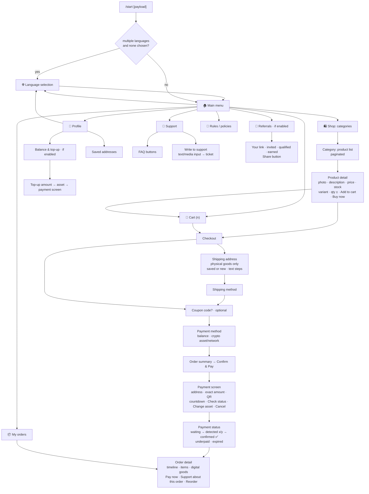
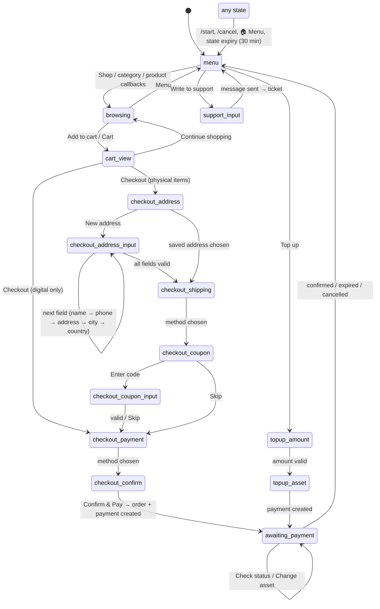

# 04 — Telegram Conversation Map (customer bot)

Design principles: inline keyboards everywhere; **edit-in-place** navigation (one "menu message"
per chat that gets edited, so the chat never floods); every callback is `answerCallbackQuery`-ed;
all user-provided text is HTML-escaped; every screen has `⬅️ Back` and `🏠 Menu`; text inputs are
requested only when unavoidable (address, support message, coupon code) and each has a `Cancel`
button; unknown input in an unexpected state gets a gentle nudge plus the menu.

## 1. Screen map

## 2. `/start` payload handling

`https://t.me/<bot>?start=<payload>` (payload ≤ 64 chars, `[A-Za-z0-9_-]`).

| Payload | Behaviour |
|---|---|
| *(none)* | upsert customer, show language/menu |
| `r_<code>` | referral: validate code (program active, not self, customer is new / no prior referrer) → `referrals.attributed`; silent on rejection |
| `p_<id22>` | open product detail directly |
| `c_<id22>` | open category |
| `o_<id22>` | open order detail (must belong to this customer) |
| `s_<code>` | staff link: bind Telegram account to a panel user for notifications (`staff_telegram_links`) |

`/start` always resets `conversation_states` to `menu` (a safe escape hatch). Other commands:
`/shop`, `/cart`, `/orders`, `/help`, `/language`, `/support`, `/cancel` (abort current text input).
Commands are registered via `setMyCommands` per language.

## 3. Conversation FSM (per `(bot_id, chat_id)`)

State row: `state_key`, `state_data` (cart snapshot ids, partial address, chosen asset, order id),
`last_menu_message_id` (message to edit), `expires_at` (30 min for inputs; checkout drafts kept as
cart). Text messages are routed by `state_key`; callbacks are routed by callback prefix regardless
of state (buttons keep working on old messages, with ownership checks).

## 4. Callback data scheme (≤ 64 bytes)

Format: `<ns>[:<arg>]*` with UUIDs encoded as 22-char base64url (`id22`). A short HMAC is **not**
needed because every handler re-authorises against the DB (product belongs to this shop, order
belongs to this customer). Unknown/malformed data → `answerCallbackQuery("Expired button")`.

| Prefix | Meaning |
|---|---|
| `m` | main menu · `lang:<code>` language |
| `sh:<page>` | shop root · `c:<id22>:<page>` category · `p:<id22>` product |
| `pv:<id22>:<variant22>` variant · `pq:<id22>:<qty>` qty · `pa:<id22>:<variant22>:<qty>` add · `pb:...` buy now |
| `ct` cart · `ct+:<item22>` / `ct-:<item22>` / `ctx:<item22>` / `ctc` clear |
| `co` checkout · `coa:<addr22>` saved address · `coa:new` · `cos:<method22>` shipping · `coc:skip` coupon skip · `cop:bal` pay balance · `cop:<asset>:<net>` · `cok` confirm |
| `pay:<pay22>:chk` check status · `pay:<pay22>:sw` switch asset · `pay:<pay22>:x` cancel |
| `o:<page>` orders · `od:<order22>` detail · `oc:<order22>` cancel · `or:<order22>` reorder |
| `pr` profile · `tu` top-up · `tua:<amount>` · `tus:<asset>:<net>` · `ad` addresses · `adx:<addr22>` delete |
| `su` support · `sun` new ticket · `suf:<n>` FAQ item |
| `rl` rules · `rla` accept policies |
| `rf` referrals |
| `nop` no-op (pagination labels) |

## 5. Screen content rules

* **Product detail:** photo (cached `file_id` per bot), name, formatted price in shop currency,
  stock hint ("In stock" / "Only 3 left" / "Sold out"), variant chips, qty `−  n  +`, `🛒 Add`,
  `⚡ Buy now`, `⬅️`. Digital pool products show "Instant delivery".
* **Payment screen:** asset/network, `pay_address` in `<code>` (tap-to-copy), exact
  `pay_amount` in `<code>`, QR code image (generated server-side, cached per payment), fiat
  equivalent, "expires in mm:ss" (message re-edited by a timer job every 60 s until expiry),
  warnings ("send exactly this amount on <network> only"), buttons `🔄 Check status`,
  `↔️ Change asset`, `❌ Cancel order`.
* **Payment status:** `waiting` → `detected (x/y confirmations)` → `confirmed ✅` (+ delivery) —
  the same message is edited; the customer is also sent a fresh notification on confirmation.
  `underpaid`: remaining amount + policy text; `expired`: "Create new payment" button (if the order
  is still open), otherwise "Order expired".
* **Order detail:** number, status timeline, items, totals, payment info (tx hash truncated with
  explorer link), delivery info / digital contents (spoiler-wrapped), buttons per state.
* **Rules:** policies from wizard (terms, refund, delivery, privacy), optional "I accept" gate
  before first checkout (`policies_accepted`).
* **Referrals:** program rules in plain language, personal link with `switch_inline_query`
  share button, counters (invited, qualified, earned), balance credited.
* **Language:** enabled languages; choice stored on customer; templates fall back to the shop
  default language, then to English.
* **Suspended shop / paused bot:** every interaction gets a single configurable "shop temporarily
  unavailable" screen; no catalog access.

## 6. Message templates & i18n

* Platform catalog: `packages/telegram/i18n/<locale>.ftl` (Fluent) — keys like
  `menu.title`, `payment.waiting`, `order.status.paid`.
* Shop overrides: `message_templates` rows (key, locale, text, buttons, media); templates support
  variables (`{shop_name}`, `{order_number}`, `{amount}`, `{customer_first_name}`) and are
  sanitised (allowed HTML subset only).
* Templates (`Classic Shop`, `Digital Store`, `Menu & Order`, `Services`) ship with tone presets
  and enabled modules; the wizard writes the shop's `template_key` + overrides.

## 7. Staff notifications through the shop bot

Staff link their Telegram via `s_<code>` deep link (code generated in the panel, 10-min TTL).
Then the shop bot sends them: new order (with `✅ Acknowledge`, `📦 Mark shipped` buttons),
payment confirmed, underpaid/expired payment, new ticket (`💬 Reply` opens a reply state),
low stock, automation failures. Notifications respect per-staff toggles. Staff callbacks are
prefixed `st:` and authorised via `staff_telegram_links` + role.

## 8. Anti-abuse in the bot

* Per-user rate limit (10 callbacks/s burst, 60/min) → silent drop + one warning.
* Payment creation limits: max 3 open payments per customer, min 60 s between new invoices,
  max 10 invoices/day (configurable) — protects merchants from "denial of wallet".
* Blocked customers get a single static message.
* Referral self-links and re-attribution attempts are ignored silently and flagged.
