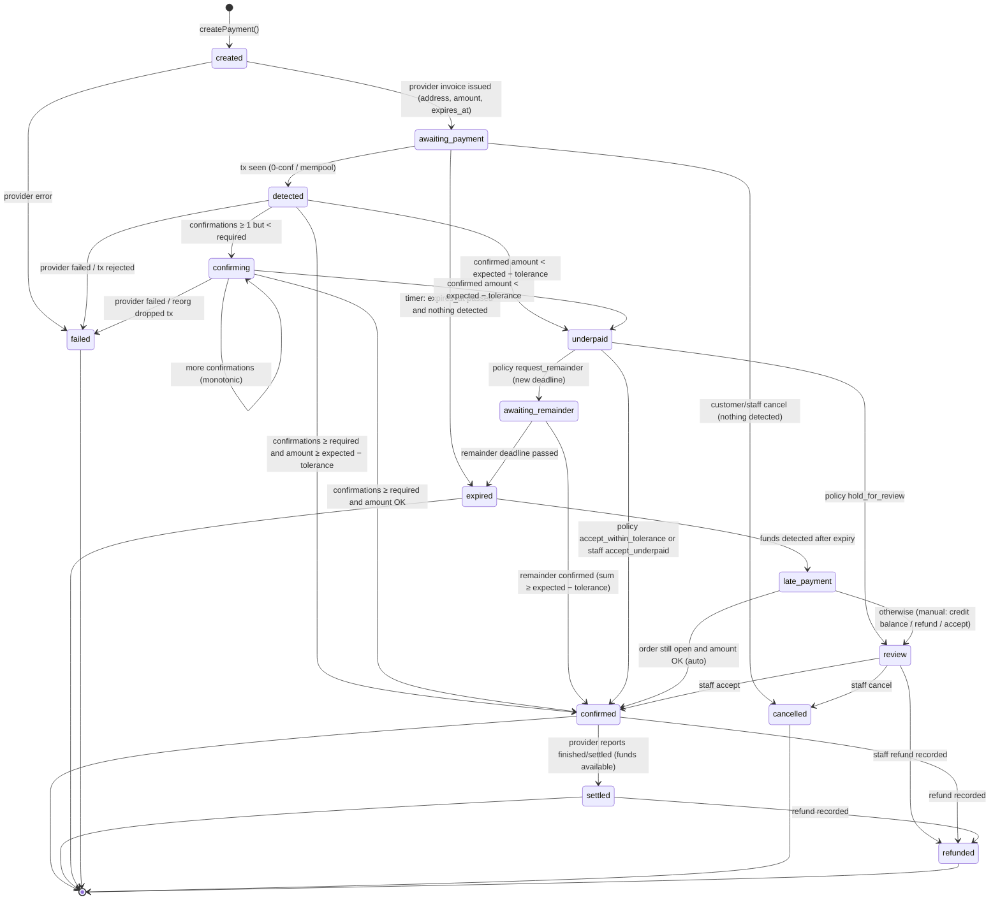
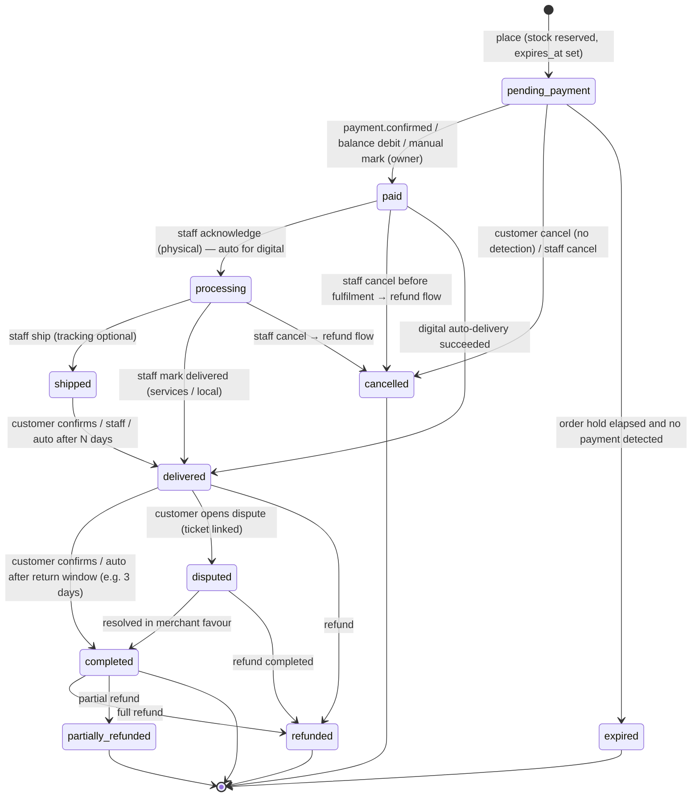
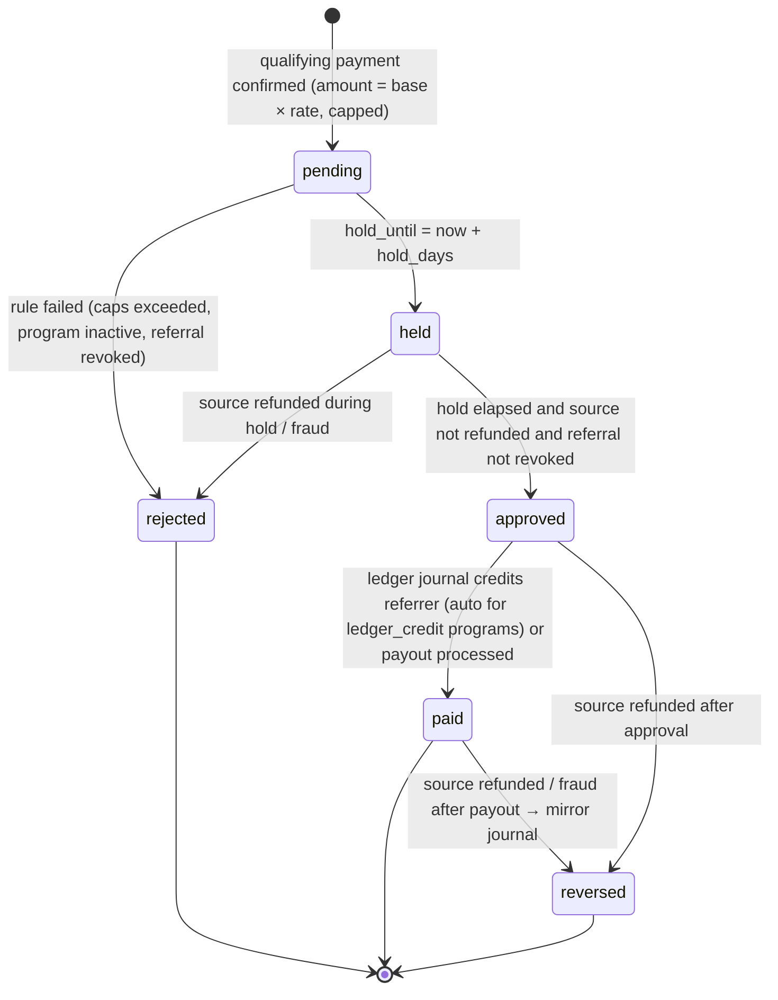
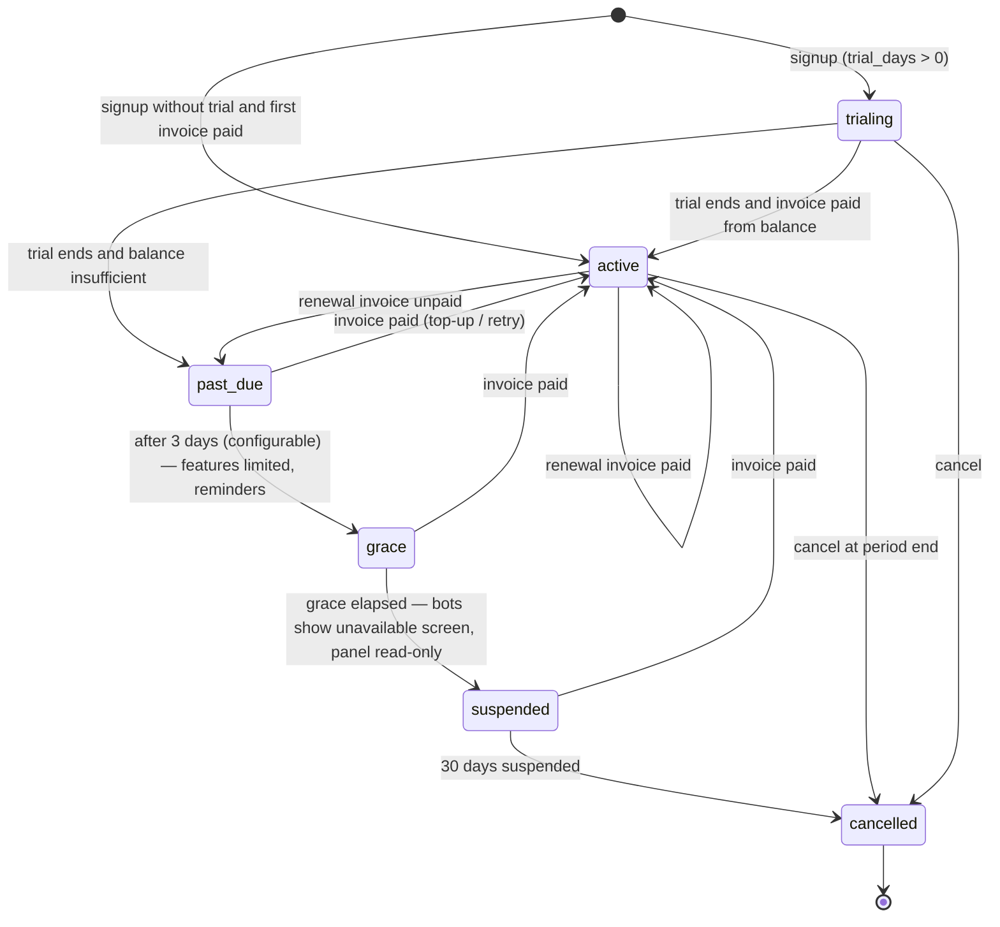
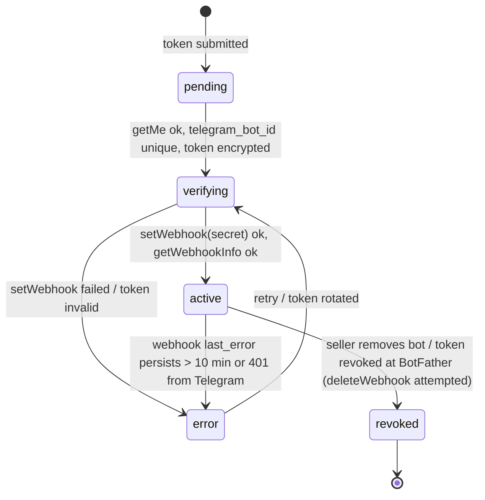
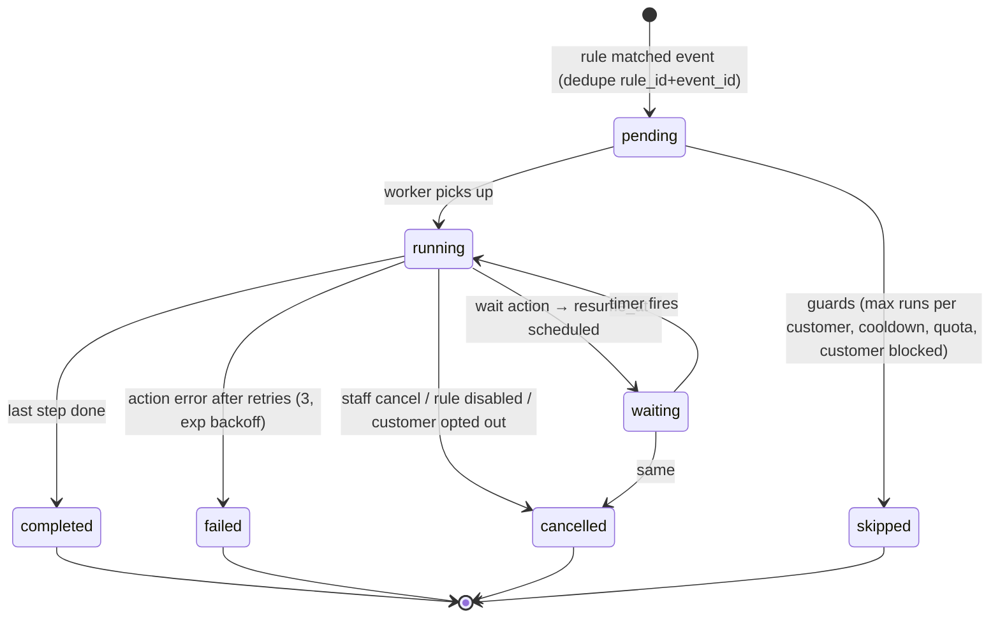

# 05 — State Machines

All state machines are implemented as pure transition tables (`packages/core/src/state/*.ts`)
of the form `transition(state, event, ctx) → { next, effects[] } | InvalidTransition`. Services
apply them inside a transaction with optimistic locking (`version` column), append a history row
(`payment_events` / `order_events` / …) and write outbox `domain_events`. Applying the same event
twice is a no-op (idempotent), never an error.

## 1. Crypto payment

**Overpayment** is not a state: `overpaid_amount > 0` is recorded on `confirmed`, and the
gateway config's `overpayment_policy` decides (`credit_balance` → ledger journal; `hold_for_review`
→ staff task; `ignore`).

**Rules**

| Rule | Detail |
|---|---|
| Sources of truth | Verified webhook **plus** re-fetch (`getPayment`) before applying; poller (`payments.poll`) every 2 min for `awaiting_payment/detected/confirming/awaiting_remainder` (backing off to 10 min after 1 h); timer job for expiry |
| Monotonicity | Confirmations and received amount only increase; a provider status "behind" ours is ignored and logged. Only an explicit `reorg`/`failed` provider status can move backwards, and only from `detected/confirming` |
| Tolerance | `underpayment_tolerance_pct` per gateway config (default 0.5 %) |
| Order coupling | `confirmed` (or `settled` if `mark_paid_on = settled`) → `order.paid` **in the same transaction**; fee accrual; digital delivery job; referral qualification event. Never on `detected` |
| Expiry vs. order | payment TTL (default 30–60 min) < order hold (default 24 h). Expired payment leaves the order `pending_payment` with `payment_status = unpaid` so the customer can create a new payment; order expiry releases stock |
| Idempotency | `payment_webhook_events.dedupe_key` unique; `applyProviderUpdate` computes the transition from the *current* row and the *fetched* provider state, so replays are no-ops |
| Reconciliation | Daily (and on demand) `reconciliation.run` compares every non-terminal payment and every payment finalized in the window against the provider; mismatch → `reconciliation_status = mismatch`, alert, admin review queue |
| Manual actions | `accept_underpaid`, `credit_balance`, `mark_refunded`, `cancel` — owner/admin only, reason mandatory, audited |

**Provider status mapping (reference adapter — NOWPayments):** `waiting → awaiting_payment`,
`confirming → confirming` (detected implied), `confirmed → confirmed`, `sending/finished →
settled`, `partially_paid → underpaid`, `expired → expired`, `failed → failed`, `refunded →
refunded`. Other adapters map similarly (BTCPay `New/Processing/Settled/Expired/Invalid`, Crypto
Pay `active/paid/expired`).

## 2. Order

Three dimensions: `status` (lifecycle), `payment_status`, `fulfillment_status`. Only `status` is a
state machine; the other two are derived projections updated by the same transitions.

| Transition | Guard | Effects |
|---|---|---|
| place | cart non-empty, products active, stock available, policies accepted (if required), plan order quota | reserve stock / digital items (`FOR UPDATE SKIP LOCKED`), allocate `number`, snapshot prices, create payment, outbox `order.created` |
| → paid | payment confirmed **or** ledger debit succeeded **or** manual mark by owner with reason | `paid_at`, fee accrual (`fee_accruals`), coupon redemption finalised, outbox `order.paid`, digital delivery job, referral `qualifying_event` |
| → expired | `now() > expires_at` and no payment in `detected/confirming/underpaid/awaiting_remainder` | release stock & digital reservations, cancel open payments, outbox `order.expired` |
| → cancelled | from `pending_payment` (customer) only if no payment detected; staff any time before `shipped` | release stock; if paid → create `refunds` request; outbox |
| → shipped/delivered/completed | role ≥ staff (or customer for confirm) | outbox events → automation (thank-you, review request), referral hold clocks |
| → refunded | refund record `completed` | fee accrual `reversed` if not yet settled (else credit note), commission reversal, outbox |

Late payment on an `expired` order: if stock can be re-reserved, the order is revived to `paid`
(explicit `revive` event, audited); otherwise the payment goes to `review` (credit balance /
manual refund).

## 3. Referral

### 3.1 Referral (referrer ↔ referee link)

```mermaid
stateDiagram-v2
  [*] --> attributed : /start r_<code> or signup with code — checks pass
  [*] --> rejected : self-referral / existing referrer / code inactive / referee not new / blocked
  attributed --> qualified : first qualifying event (top-up credited ≥ min, order paid, subscription paid)
  attributed --> expired : attribution_window_days elapsed without qualification
  attributed --> revoked : fraud flag confirmed by admin
  qualified --> active : commission-earning period continues (same state semantics; kept for reporting)
  qualified --> revoked : fraud / chargeback pattern
  active --> expired : commission window ended (if program limits duration)
  active --> revoked : fraud
  rejected --> [*]
  expired --> [*]
  revoked --> [*]
```

**Attribution rules:** first-touch, immutable (`UNIQUE(program_id, referee)`); referee must be
new to the shop/platform (created within `attribution_window` and with no prior orders/payments);
self-referral blocked by identity (same Telegram id / same user / same tenant), by device/IP match
on web signups (flag, not block), by payment address reuse (flag); code owner must be active;
referrer must not be the referee's own staff.

### 3.2 Commission (money)

Commission is computed **only** from `payment.confirmed`/`topup.credited`/`invoice.paid` events,
never from `detected`. One commission per `(program, source)`; monthly and per-referral caps
enforced at creation; `referrals.release` job moves `held → approved → paid` on schedule.

## 4. Subscription (merchant billing)

Upgrades take effect immediately with proration (credit line on the next invoice); downgrades at
period end; plan version pinned per subscription; limits enforced via `usage_counters` with
`overage.mode` (`block` → `plan_limit_reached`, `soft` → warn, `charge` → overage invoice line).

## 5. Bot provisioning

## 6. Automation run

## 7. Support ticket

`open` → (`staff reply`) → `pending_customer` → (`customer reply`) → `pending_staff` →
`resolved` (staff) → `closed` (auto after 3 days / customer confirms); customer reply on
`resolved` re-opens to `pending_staff`. Any state → `closed` by staff.

## 8. Top-up

`pending` (payment created) → `credited` (payment confirmed, ledger journal) /
`partially_credited` (underpaid accepted for the received amount, per policy) / `expired` /
`failed`. Referral commission is evaluated on `credited` / `partially_credited`.
